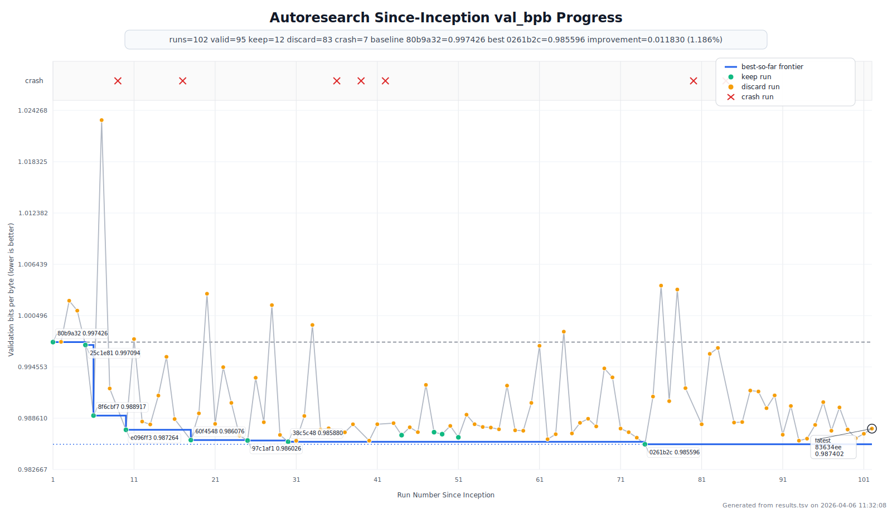
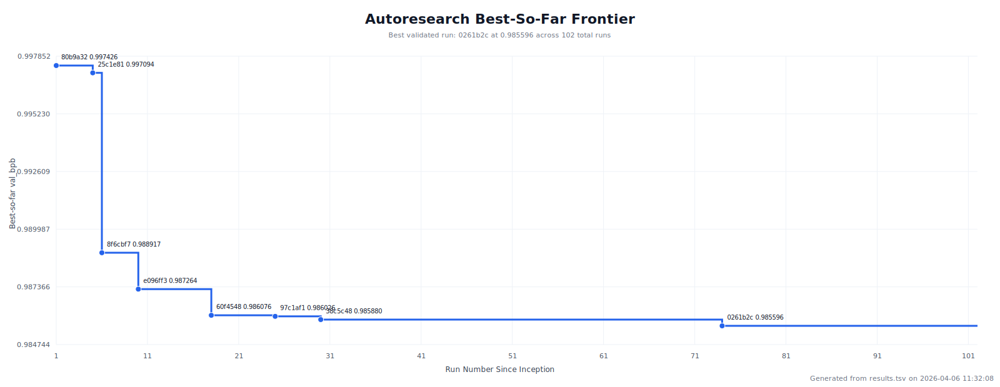

# autoresearch-evo

A novelty/evolutionary-search-oriented fork of [karpathy/autoresearch](https://github.com/karpathy/autoresearch).

This fork keeps the original spirit of the project, a single small LLM training loop that an agent can perturb autonomously under a fixed 5-minute budget, but adds a lightweight discovery control plane around that loop:

- emitter-based mutation selection instead of a single hill-climbing style
- archive/niche memory so stepping stones are not immediately forgotten
- conjecture and crash memory carried between turns
- hook-driven autonomous continuation on `autoresearch/*` branches
- a repo-local Modal GPU runner with persistent cache volumes and faster launch behavior

The public branch is curated to keep only the intentional fork surface: the control-plane, the runner, tests, the best validated `train.py` found in our run history, and release charts summarizing the search.

## Upstream Base

The clean base for this fork is `karpathy/autoresearch`, which provides:

- `prepare.py` for one-time data prep and evaluation utilities
- `train.py` as the only experiment target
- a fixed 5-minute training budget
- `val_bpb` as the optimization metric

This repo keeps that contract. The benchmark is still the same 5-minute `train.py` run. The Modal timeout is only an outer guardrail around remote startup, sync, and evaluation.

## What This Fork Adds

The main addition is a small repo-local discovery layer:

- `.codex/hooks.json` wires session-start, prompt-submit, pre-tool, post-tool, and stop-time hooks
- `research/` stores the shared state/update logic for archive memory, emitter selection, and run review
- `scripts/modal_gpu.py` runs the loop on remote NVIDIA GPUs while reusing dependency and cache state aggressively
- `program.md` defines the agent-facing research protocol
- `tests/` covers the control-plane and runner behavior with stdlib-only unit tests

The search loop chooses among:

- `local_tuner`
- `optimizer_hacker`
- `architecture_mutator`
- `simplifier`
- `contrarian`
- `recombinator`
- `anomaly_chaser`

## Best Validated Configuration Shipped Here

This public branch ships the best validated `train.py` configuration we found during the since-inception run history used for the charts below.

Best validated run:

- commit: `0261b2c`
- `val_bpb`: `0.985596`
- baseline: `80b9a32` at `0.997426`
- absolute improvement: `0.011830`
- relative improvement: about `1.186%`

The most important differences versus the discovery-path base are:

- shared norm changed from pure RMSNorm to LayerNorm with dtype preservation
- q/k normalization changed to a mixed RMSNorm/LayerNorm path
- total batch reduced to `2**17`
- Muon weight decay retuned to `0.109`
- warmup restored to `2%`
- device batch reduced to `64`

This is not presented as a final optimum, only as the best validated point discovered in this release cut.

## Since-Inception Research Progress

Overall run history, including keeps, discards, crashes, and the best-so-far frontier:



Frontier-only view to make the cumulative best improvements easier to inspect:



Release-cut summary:

- total runs: `102`
- keeps: `12`
- discards: `83`
- crashes: `7`
- best run: `0261b2c` at `0.985596`

## Quick Start

Requirements:

- Python 3.10+
- `uv`
- a single NVIDIA GPU locally, or Modal access if using the remote runner

Setup:

```bash
uv sync
uv run prepare.py
```

Local benchmark run:

```bash
uv run train.py
```

Remote GPU run through the repo-local runner:

```bash
python scripts/modal_gpu.py --gpu H100 --timeout 10 -- uv run train.py > run.log 2>&1
```

The inner command must remain exactly `uv run train.py`. The runner only handles transport, cache reuse, and sandbox lifecycle.

Optional runner overrides:

- `AUTORESEARCH_MODAL_APP_NAME`
- `AUTORESEARCH_MODAL_DATA_VOLUME_NAME`
- `AUTORESEARCH_MODAL_HF_VOLUME_NAME`

## Repo Layout

```text
prepare.py             # fixed data prep + evaluation utilities
train.py               # single experiment target, shipped at the best validated config
program.md             # agent-facing research protocol
.codex/                # repo-local Codex config + hooks
research/              # discovery-state logic
scripts/modal_gpu.py   # remote GPU runner
tests/                 # control-plane and runner tests
docs/figures/          # release charts
```

## Testing

```bash
python3 -m py_compile research/core.py scripts/modal_gpu.py train.py
python3 -m unittest tests/test_research_core.py tests/test_modal_gpu.py
```

## License

MIT
